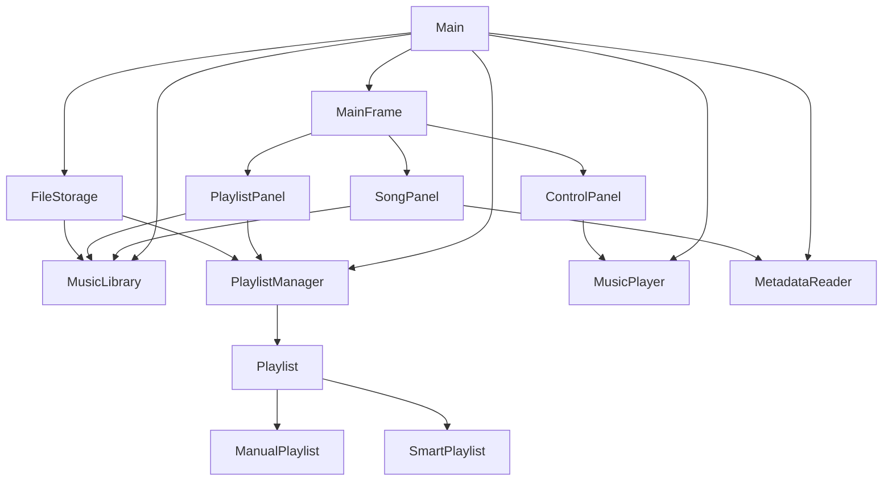

# Music Library Management System - Full Learning Guide

This document is for learning the whole app in a way that is easy to study, explain, and present.

## 1. What this app is

This project is a Java Swing desktop application for managing and playing MP3 music files.

Main user goals:

- import songs into a library
- search and sort songs
- create playlists
- create smart playlists
- play songs
- save data and load it again later

## 2. What problem the app solves

Without this app, a user would have music files stored on the computer but no simple desktop tool to:

- organize them into one library
- search by title or artist
- group them into playlists
- build automatic playlists from rules
- play songs from inside the same program

So the app combines music management and playback in one place.

## 3. Main technologies used

- Java
- Java Swing for the GUI
- Maven for dependency management
- Jaudiotagger for MP3 metadata
- JLayer for MP3 playback

## 4. Package structure

The app is split into packages so each part has one main responsibility.

```text
app       -> starts the application
gui       -> windows, panels, buttons, labels, user interaction
manager   -> manages songs and playlists
model     -> core data objects
player    -> MP3 playback
service   -> metadata reading and file storage
```

Why this structure is good:

- easier to read
- easier to explain
- easier to maintain
- business logic is not mixed into the GUI too much

## 5. Full startup flow

The app starts in `app.Main`.

Step-by-step:

1. `Main.main(...)` runs
2. `SwingUtilities.invokeLater(...)` starts the GUI safely on the Swing thread
3. Main objects are created:
   - `MusicLibrary`
   - `PlaylistManager`
   - `MusicPlayer`
   - `FileStorage`
   - `MetadataReader`
4. Songs are loaded from `data/songs.txt`
5. Playlists are loaded from `data/playlists.txt`
6. `MainFrame` is created
7. `MainFrame` creates the GUI panels
8. The window becomes visible

Why songs load before playlists:

- playlists store song file paths
- when playlists are loaded, they need to reconnect those paths to real `Song` objects
- if songs are not loaded first, playlist reconstruction will fail

## 6. Main window structure

The main window class is `MainFrame`.

It connects three major GUI parts:

- `SongPanel`
- `PlaylistPanel`
- `ControlPanel`

High-level layout:

- left side: song library area
- right side: playlist area
- bottom: playback controls

What `MainFrame` does:

- creates panels
- connects panel communication
- saves data when needed
- handles cleanup when songs are deleted
- stops playback and saves before the app closes

## 7. Core classes and what each one does

### 7.1 `Song`

This class represents one song.

Fields:

- `title`
- `artist`
- `filePath`
- `durationSeconds`

Important methods:

- getters and setters
- `getDisplayText()`
- `equals(...)`
- `hashCode()`

Important design choice:

- two songs are considered equal if their file paths are equal

Why this matters:

- same file should not be imported twice
- title and artist are not always unique

### 7.2 `Playlist`

This is an abstract parent class.

It stores shared playlist data:

- `name`

It defines common methods that subclasses must implement:

- `getPlaylistType()`
- `isEditable()`
- `addSong(...)`
- `removeSong(...)`
- `getSongs()`

This class is important because it enables inheritance and polymorphism.

### 7.3 `ManualPlaylist`

This is the normal playlist type.

Behavior:

- stores songs directly in an `ArrayList<Song>`
- user can add songs manually
- user can remove songs manually
- `isEditable()` returns `true`

### 7.4 `SmartPlaylist`

This is the automatic playlist type.

It does not store a fixed song list directly.

Instead, it stores:

- a reference to `MusicLibrary`
- a rule field
- a keyword

Current rule fields:

- `TITLE`
- `ARTIST`

How it works:

- when `getSongs()` is called, the smart playlist checks the current music library
- it returns all songs whose title or artist contains the keyword

Important behavior:

- `addSong(...)` returns `false`
- `removeSong(...)` returns `false`
- `isEditable()` returns `false`

Why:

- smart playlists update from rules, not direct user editing

### 7.5 `MusicLibrary`

This class manages the main song collection.

Main responsibilities:

- add songs
- remove songs
- search songs
- sort songs by title
- sort songs by artist
- find songs by file path

Data structure used:

- `ArrayList<Song>`

Important methods:

- `addSong(...)`
- `removeSong(...)`
- `containsSongFilePath(...)`
- `findSongByFilePath(...)`
- `sortByTitle()`
- `sortByArtist()`
- `searchSongs(...)`
- `getAllSongs()`

### 7.6 `PlaylistManager`

This class manages all playlists.

Data structure used:

- `ArrayList<Playlist>`

This is important:

- it stores playlists using the parent type `Playlist`
- that means both `ManualPlaylist` and `SmartPlaylist` can be stored together

Main responsibilities:

- create manual playlists
- create smart playlists
- add already-created playlists
- delete playlists
- find playlist by name
- remove a deleted song from all playlists

### 7.7 `MusicPlayer`

This is the most technical class in the project.

Purpose:

- play MP3 files
- pause
- resume
- go to next song
- go to previous song
- support shuffle
- support repeat
- keep approximate playback time

Important fields:

- `currentQueue`
- `currentIndex`
- `state`
- `repeatMode`
- `shuffleEnabled`
- `pausedFrame`
- `currentFrame`
- `elapsedMilliseconds`

Why it is more complex:

- playback runs on a background thread
- MP3 pause/resume is handled by frame position
- song ending, stopping, and queue navigation must stay in sync

### 7.8 `MetadataReader`

This class reads MP3 metadata using Jaudiotagger.

It tries to read:

- title
- artist
- duration

If reading fails:

- it returns empty metadata
- the app stays stable
- the GUI asks the user to enter missing information manually

### 7.9 `MetadataInfo`

This is a simple helper class used as a data holder for metadata.

It stores:

- title
- artist
- duration

Why it exists:

- metadata reading and `Song` creation are related but not exactly the same thing
- keeping them separate makes the code cleaner

### 7.10 `FileStorage`

This class handles saving and loading.

Files used:

```text
data/songs.txt
data/playlists.txt
```

Main responsibilities:

- save songs
- load songs
- save playlists
- load playlists
- support legacy playlist save format

## 8. GUI classes in detail

### 8.1 `SongPanel`

This panel manages the song library UI.

Main visible actions:

- import MP3 files
- search
- clear search
- sort by title
- sort by artist
- edit song
- delete song

Important flow:

- it does not manage raw song data alone
- it asks `MusicLibrary` to do data operations
- then it refreshes the list in the GUI

### 8.2 `PlaylistPanel`

This panel manages playlists.

Main visible actions:

- create playlist
- delete playlist
- add selected song to manual playlist
- remove selected song from manual playlist

It also:

- shows all playlists
- shows the songs inside the selected playlist
- shows smart-playlist rule details

Important behavior:

- manual playlists can be edited
- smart playlists cannot be edited manually
- button states change based on playlist type

### 8.3 `ControlPanel`

This panel manages playback controls.

Main visible actions:

- previous
- play
- pause
- next
- shuffle
- repeat

It also shows:

- now playing label
- time label

Important behavior:

- if the current song is paused, the play button changes to `Resume`
- the time label updates every second using a Swing `Timer`

## 9. Main user features and how they work

### 9.1 Import songs

Flow:

1. user clicks `Import MP3 Files`
2. `SongPanel` opens a file chooser
3. user selects one or more MP3 files
4. each file is checked:
   - valid MP3?
   - already imported?
5. `MetadataReader` tries to read metadata
6. if metadata is incomplete, a popup asks for title/artist
7. `Song` is created
8. `MusicLibrary.addSong(...)` stores it
9. data is saved
10. song list refreshes

### 9.2 Search songs

Flow:

1. user enters a keyword
2. `SongPanel` calls `MusicLibrary.searchSongs(...)`
3. `MusicLibrary` checks title and artist
4. matching songs are returned
5. list refreshes

Search behavior:

- case-insensitive
- partial match

### 9.3 Sort songs

Two options:

- sort by title
- sort by artist

Flow:

1. user clicks sort button
2. `SongPanel` calls the correct sort method
3. `MusicLibrary` sorts the internal list
4. GUI refreshes
5. data is saved

### 9.4 Edit song

Flow:

1. user selects a song
2. user clicks `Edit Song`
3. popup opens
4. title and artist can be changed
5. song object is updated
6. data is saved
7. relevant views refresh

### 9.5 Delete song

Flow:

1. user selects a song
2. user clicks `Delete Song`
3. confirmation popup opens
4. `MainFrame` prepares cleanup:
   - remove song from all playlists
   - remove song from playback queue
5. `MusicLibrary.removeSong(...)` removes it
6. data is saved
7. views refresh

Important detail:

- the song is removed from the app library
- the actual MP3 file is not deleted from the computer

### 9.6 Create manual playlist

Flow:

1. user clicks `Create Playlist`
2. user chooses `Manual Playlist`
3. user enters playlist name
4. `PlaylistManager.createManualPlaylist(...)` runs
5. playlist list refreshes
6. data is saved

### 9.7 Create smart playlist

Flow:

1. user clicks `Create Playlist`
2. user chooses `Smart Playlist`
3. user enters playlist name
4. user chooses rule field:
   - artist contains
   - title contains
5. user enters keyword
6. `PlaylistManager.createSmartPlaylist(...)` runs
7. playlist list refreshes
8. data is saved

When selected later:

- `SmartPlaylist.getSongs()` computes matches from the current library

### 9.8 Delete playlist

Flow:

1. user selects a playlist
2. user clicks `Delete Playlist`
3. confirmation popup opens
4. `PlaylistManager.deletePlaylist(...)` removes it
5. data is saved
6. playlist view refreshes

### 9.9 Add song to playlist

This works only for manual playlists.

Flow:

1. user selects a library song
2. user selects a manual playlist
3. user clicks `Add Selected Song`
4. `ManualPlaylist.addSong(...)` runs
5. if success:
   - data saves
   - playlist song list refreshes

If playlist is smart:

- add button is disabled
- manual edit is blocked

### 9.10 Remove song from playlist

This also works only for manual playlists.

Flow:

1. user selects a song inside the selected playlist
2. user clicks `Remove From Playlist`
3. `ManualPlaylist.removeSong(...)` runs
4. data saves
5. view refreshes

### 9.11 Playback

Flow:

1. user selects a song
2. user clicks `Play`
3. `ControlPanel` calls `MusicPlayer.playSong(...)`
4. `MusicPlayer` builds the queue from the songs currently shown in the song list
5. playback starts on a background thread

Pause flow:

1. user clicks `Pause`
2. current frame and elapsed time are saved
3. audio resources close
4. player state becomes paused

Resume flow:

1. user clicks `Resume`
2. player reopens the file
3. it skips to the saved frame
4. playback continues

Next/previous flow:

- queue order depends on current displayed songs
- shuffle and repeat can change the next song choice

## 10. How queue logic works

Playback queue source:

- the queue comes from the songs currently displayed in `SongPanel`

That means:

- if user searched for a smaller subset, next/previous uses that subset
- if user cleared search, next/previous uses the full visible library list

This is useful to explain because it shows that playback is connected to the current user view.

## 11. Repeat and shuffle behavior

### Repeat modes

Enum:

```java
OFF, ONE, ALL
```

Behavior:

- `OFF`: stop when queue ends
- `ONE`: replay the same song
- `ALL`: after the last song, return to the first

### Shuffle

Behavior:

- when enabled, next song can be randomly selected
- if possible, it avoids selecting the same song again immediately

## 12. Save and load format

### 12.1 Songs file

File:

```text
data/songs.txt
```

Each line:

```text
encodedTitle|encodedArtist|encodedFilePath|durationSeconds
```

Encoding used:

- Base64

Why Base64 is used:

- safer text storage
- special characters in file paths or song names are less likely to break the file format

### 12.2 Playlists file

File:

```text
data/playlists.txt
```

Manual playlist line:

```text
encodedType|encodedPlaylistName|encodedSongPath1|encodedSongPath2|...
```

Smart playlist line:

```text
encodedType|encodedPlaylistName|encodedRuleField|encodedKeyword
```

Legacy support:

- old playlist lines without explicit type are still loaded as manual playlists

## 13. OOP concepts used in this app

### Encapsulation

Used in many classes.

Example:

- fields are private
- access is controlled through methods

Good examples:

- `Song`
- `MusicLibrary`
- `Playlist`
- `MusicPlayer`

### Abstraction

Used in:

- `Playlist` as an abstract parent class

Why:

- it defines what every playlist must be able to do
- it does not force all playlists to behave in the same internal way

### Inheritance

Used in:

- `ManualPlaylist extends Playlist`
- `SmartPlaylist extends Playlist`

### Polymorphism

Used when code works with the parent type `Playlist` instead of always using a specific subclass.

Examples:

- `ArrayList<Playlist>` in `PlaylistManager`
- `Playlist selectedPlaylist` in `PlaylistPanel`

Then Java chooses the correct subclass behavior for:

- `getSongs()`
- `addSong(...)`
- `removeSong(...)`
- `isEditable()`

### Data structures

Main ones used:

- `ArrayList<Song>`
- `ArrayList<Playlist>`
- `DefaultListModel<Song>`
- `DefaultListModel<Playlist>`

## 14. Most important class relationships



## 15. What is easiest and hardest to explain

### Easier parts

- package structure
- song import
- search
- sort
- manual playlists
- save/load overview

### Harder parts

- `MusicPlayer`
- pause/resume by frame
- playback thread
- smart playlist polymorphism if explained poorly

## 16. Best way to explain how the app was built

Explain it in layers.

### Layer 1: user features

"First, the app needed music library features such as import, search, sort, and playlists. Then playback was added. After that, persistence was added so songs and playlists stay after restart."

### Layer 2: code architecture

"The app was separated into model, manager, GUI, playback, and service packages so each class had one clear job."

### Layer 3: OOP design

"The library and playlist logic were separated into manager classes. Later, the playlist system was improved by introducing an abstract `Playlist` parent class and two subclasses: `ManualPlaylist` and `SmartPlaylist`."

### Layer 4: technical details

"Songs and playlists are saved in text files. Metadata comes from Jaudiotagger. Playback is handled by JLayer on a background thread."

## 17. Short explanation for each major class

Use these during practice.

### `Main`

"Starts the app, creates the main objects, loads saved data, and opens the main window."

### `MainFrame`

"Connects all panels together and coordinates saving and cleanup."

### `SongPanel`

"Handles all library-side user actions such as import, search, sort, edit, and delete."

### `PlaylistPanel`

"Handles playlist creation, playlist deletion, smart playlist rules, and showing songs in playlists."

### `ControlPanel`

"Handles playback buttons and playback status labels."

### `MusicLibrary`

"Stores all songs and provides search, sort, add, remove, and lookup operations."

### `PlaylistManager`

"Stores all playlists and manages creating, deleting, and finding playlists."

### `Playlist`

"Abstract parent for all playlist types."

### `ManualPlaylist`

"Normal editable playlist that stores songs directly."

### `SmartPlaylist`

"Automatic playlist that finds songs from a rule."

### `MusicPlayer`

"Handles MP3 playback, pause/resume, queue movement, shuffle, repeat, and current time."

### `FileStorage`

"Handles saving and loading songs and playlists."

### `MetadataReader`

"Reads metadata from MP3 files before songs are added."

## 18. Likely teacher questions and good answers

### Q1. Why is `Song.equals()` based on file path?

Good answer:

"Because the file path uniquely identifies the imported MP3 file in this app. Two songs could share the same title or artist, but they should still be treated as different if the files are different."

### Q2. Why load songs before playlists?

Good answer:

"Playlists store song paths, so songs must exist in the library first. Then playlists can reconnect those paths to the correct `Song` objects."

### Q3. Where is inheritance used?

Good answer:

"Inheritance is used in the playlist system. `Playlist` is the abstract parent class, and `ManualPlaylist` and `SmartPlaylist` are subclasses."

### Q4. Where is polymorphism used?

Good answer:

"The app stores playlists using the parent type `Playlist`. Then methods like `getSongs()` behave differently depending on whether the object is a `ManualPlaylist` or a `SmartPlaylist`."

### Q5. Why can smart playlists not be edited manually?

Good answer:

"Because their song list comes from a rule, not direct user storage. If manual add/remove were allowed, the playlist would no longer behave consistently as a rule-based playlist."

### Q6. Why run playback on a separate thread?

Good answer:

"If playback ran on the Swing GUI thread, the window could freeze. A separate thread keeps the interface responsive while audio is playing."

### Q7. Why use Base64 in save files?

Good answer:

"It makes text storage safer for file paths and special characters. It is not encryption, just a safer text format for this project."

## 19. Best order to study the app

Recommended study order:

1. `Song`
2. `Playlist`, `ManualPlaylist`, `SmartPlaylist`
3. `MusicLibrary`
4. `PlaylistManager`
5. `FileStorage`
6. `SongPanel`
7. `PlaylistPanel`
8. `ControlPanel`
9. `MusicPlayer`
10. `MainFrame`
11. `Main`

Why this order helps:

- first learn the data objects
- then learn business logic
- then learn the GUI
- finally learn playback and startup wiring

## 20. Best order to demo the app

Recommended demo order:

1. open the app
2. import a few MP3 files
3. search by title or artist
4. sort the library
5. create a manual playlist and add songs
6. create a smart playlist from artist or title keyword
7. delete a playlist
8. play a song
9. pause and resume
10. show shuffle or repeat
11. close and reopen to prove save/load works

## 21. Short 2-minute presentation version

Possible short script:

"This project is a Java Swing music library management app. It lets users import MP3 files, search and sort songs, create playlists, create smart playlists, and play songs with shuffle and repeat. The code is organized into separate packages for GUI, models, managers, playback, and services. For OOP design, the playlist system uses an abstract parent class called `Playlist`, with two subclasses: `ManualPlaylist` and `SmartPlaylist`. This lets the app use inheritance and polymorphism in a practical feature. Songs and playlists are also saved to local text files so the library is persistent across app restarts."

## 22. Common mistakes to avoid when explaining

- do not say smart playlists store songs manually
- do not say the app deletes MP3 files from the computer
- do not say Base64 is encryption
- do not forget that songs load before playlists
- do not forget that playback queue comes from the currently displayed song list

## 23. Final study checklist

Make sure these can be explained confidently:

- package roles
- startup flow
- song import flow
- search and sort flow
- manual playlist flow
- smart playlist flow
- delete song cleanup flow
- playback flow
- save/load format
- encapsulation
- inheritance
- polymorphism
- why a background thread is used for playback

## 24. Final summary

This app is not too hard to understand once it is learned in layers:

- data objects first
- managers second
- GUI third
- playback and persistence last

The most important idea to remember is this:

- `Song` and playlist classes model the data
- manager classes control the data
- GUI classes let the user interact with the data
- service classes support metadata and persistence
- `MusicPlayer` handles audio playback separately

Use this file for studying. Use `README_SUBMISSION.md` for concise presentation and submission.
