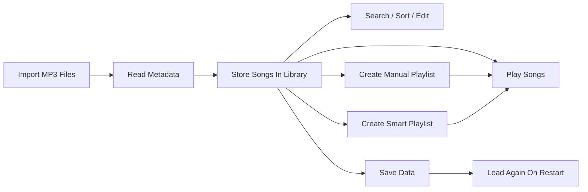
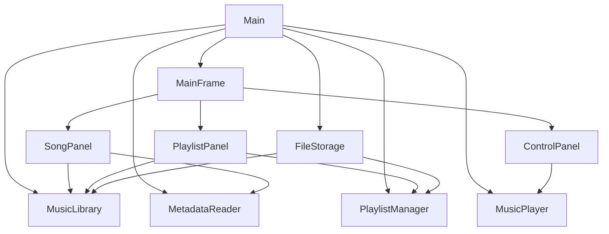
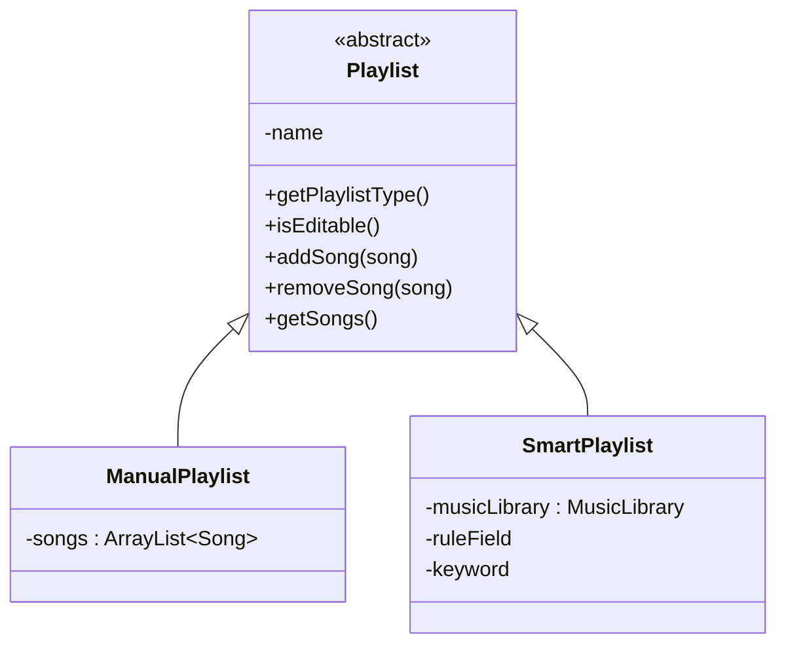

# Music Library Management System - Poster Draft

Use this as the content base for the final A0 landscape poster.

## 1. Poster Style Direction

Recommended style:

- A0 landscape
- 3-column layout
- light background
- dark text
- one accent color such as blue or green
- large screenshots
- short bullets only

Recommended sections:

1. Title and team
2. Problem and objectives
3. System workflow
4. Architecture and design
5. Key features
6. OOP concepts and data structures
7. Algorithms and implementation
8. Testing and evaluation
9. Limitations and future work
10. Conclusion

## 2. Title Block

Title:

**Music Library Management System**

Subtitle:

**A Java Swing desktop application for managing and playing MP3 files**

Small summary:

- import MP3 files
- manage songs and playlists
- create smart playlists
- play songs with shuffle and repeat
- save and load data automatically

## 3. Problem Statement

Suggested content:

- Users often store many MP3 files locally but lack a simple desktop tool to organize, search, group, and play them in one place.
- This project builds a usable music library management system that combines file import, playlist management, and MP3 playback in a single Java application.

## 4. Objectives

- Build a working Java desktop application with a graphical user interface
- Apply OOP concepts such as encapsulation, inheritance, abstraction, and polymorphism
- Use suitable data structures to manage songs and playlists
- Support real playback and persistent storage

## 5. Visualization Ideas

Best visuals for this project:

### Visual 1: User workflow

Why use it:

- easy to understand quickly
- shows end-to-end app usage

Use this diagram:

### Visual 2: System architecture

Why use it:

- proves design quality
- helps explain code organization

Use this diagram:

### Visual 3: OOP / inheritance diagram

Why use it:

- this is one of the strongest academic parts of the project
- easy to explain during poster questions

Use this diagram:

### Visual 4: Feature screenshots

Use 4 to 6 screenshots with labels:

1. Main interface
2. Import songs
3. Search and sort
4. Manual playlist
5. Smart playlist
6. Playback controls

Best screenshot captions:

- Main interface with library, playlists, and playback controls
- Importing MP3 files with automatic metadata reading
- Searching and sorting songs in the library
- Manual playlist management
- Smart playlist generated by title or artist rule
- Playback with pause, next, shuffle, and repeat

### Visual 5: Testing table

Why use it:

- simple way to show evaluation
- makes the poster look more complete

Use this table:

| Feature | Test Case | Result |
|---|---|---|
| Import songs | Imported multiple MP3 files | Passed |
| Search | Search by title and artist | Passed |
| Sort | Sort by title and artist | Passed |
| Manual playlist | Add and remove songs | Passed |
| Smart playlist | Match title or artist keyword | Passed |
| Playback | Play, pause, resume, next, previous | Passed |
| Save/load | Close and reopen app | Passed |
| Delete | Delete songs and playlists | Passed |

## 6. Architecture And Design

Suggested bullets:

- The system is organized into clear packages: `app`, `gui`, `manager`, `model`, `player`, and `service`
- GUI classes manage user interaction
- Manager classes handle song and playlist logic
- Model classes represent domain objects such as songs and playlists
- Service classes support metadata reading and file persistence
- Playback is separated into a dedicated `MusicPlayer` class

## 7. Key Features

- Import one or multiple MP3 files
- Read metadata automatically
- Search songs by title or artist
- Sort songs by title or artist
- Edit and delete songs
- Create manual playlists
- Create smart playlists based on title or artist keywords
- Play songs with pause, resume, next, previous, shuffle, and repeat
- Save and load songs and playlists automatically

## 8. OOP Concepts And Data Structures

Suggested bullets:

### OOP concepts

- Encapsulation: private fields and controlled access in classes such as `Song`, `MusicLibrary`, and `MusicPlayer`
- Abstraction: `Playlist` is designed as an abstract parent class
- Inheritance: `ManualPlaylist` and `SmartPlaylist` extend `Playlist`
- Polymorphism: playlists are handled through the parent type `Playlist`, while behavior changes by subclass

### Data structures

- `ArrayList<Song>` for storing songs
- `ArrayList<Playlist>` for storing playlists
- `DefaultListModel<Song>` for GUI song lists
- `DefaultListModel<Playlist>` for GUI playlist lists

## 9. Algorithms And Implementation Highlights

Suggested bullets:

- Search uses case-insensitive partial matching on title and artist
- Sorting uses `Comparator` for title-based and artist-based ordering
- Smart playlists dynamically filter songs by rule
- Playback queue supports next, previous, shuffle, and repeat modes
- Save files use Base64 text encoding for safer storage of paths and names

## 10. Testing And Evaluation

Suggested summary:

- The system was tested using common user flows such as import, search, sort, playlist creation, playback, deletion, and restart persistence.
- Results showed that the application performs correctly for the main intended functions.

## 11. Limitations

- Playback time is approximate
- No progress bar seeking
- No volume control
- Smart playlists currently support only simple keyword rules

## 12. Future Improvements

- Add volume control
- Add progress bar and seeking
- Support more metadata fields such as album and genre
- Support advanced smart playlist rules
- Improve UI styling and filtering options

## 13. Conclusion

Suggested content:

- The project successfully delivers a functional Java music library application with real MP3 playback.
- It demonstrates practical use of OOP concepts, data structures, GUI programming, and file persistence.
- The final design is modular, explainable, and suitable for further extension.

## 14. Suggested Poster Layout

### Left column

- Title
- Problem statement
- Objectives
- Workflow diagram

### Middle column

- Architecture diagram
- OOP / inheritance diagram
- Short design explanation

### Right column

- Key feature screenshots
- Testing table
- Limitations
- Future work
- Conclusion

## 15. What To Build Next

Best next steps:

1. Take 5 to 6 clean screenshots from the app
2. Copy this content into PowerPoint or Canva
3. Convert the mermaid diagrams into shapes manually, or keep them as diagram references
4. Export to PDF

## 16. Best Poster Talking Points

Use these during the poster session:

- “The system is divided into GUI, logic, model, playback, and service layers.”
- “The playlist system demonstrates inheritance and polymorphism through `Playlist`, `ManualPlaylist`, and `SmartPlaylist`.”
- “Smart playlists are a meaningful feature, not just a technical OOP example.”
- “The application supports real MP3 playback and persistent save/load behavior.”
